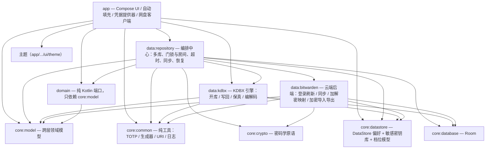
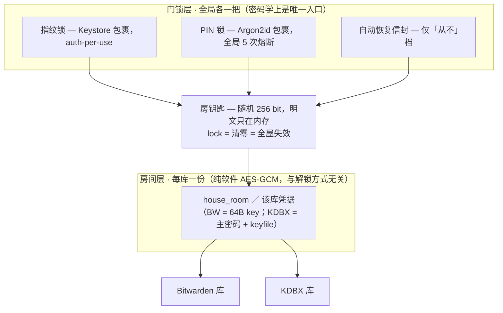

# 长期约定 8.10 · 架构与目录地图（**接力用**）

> 索引：[`../MEMORY.md`](../MEMORY.md) §8 · 坑：[`../ISSUES.md`](../ISSUES.md)
>
> **这份文件回答两件事**：①**东西在哪**（模块 / 包 / 关键文件）；②**该信哪份文档**。
> **它不回答"为什么这样设计"** —— 那是 [`../decisions/`](../decisions/) 的职责，本文只放指针。
>
> ★ **本文的图与表都是从当前代码里核出来的，可复核**（不是"看起来合理"的推测）：
> 依赖边 = `grep -oE "projects\.[a-z0-9.]+" <模块>/build.gradle.kts`；
> 模块清单 = `settings.gradle.kts`；文件清单 = `find <模块>/src/main -name "*.kt"`。
> 代码变了请顺手改这里 —— 地图错了比没有地图更坏（下一棒会照错的找）。

---

## 1. ⚠️ 先读这条：**哪份文档说了算**

| 位置 | 性质 | 该不该信 |
|---|---|---|
| `../decisions/*.md` | **定稿**（用户逐项拍板） | ★★★ **真源**，代码注释直接引用 |
| `../conventions/8.1~8.10-*.md` | **长期约定**（含本篇） | ★★★ 真源 |
| `../ISSUES.md` + `../issues/0x-*.md` | 已知坑（现象 → 根因 → 解法） | ★★★ 真源 |
| `../SESSION-YYYY-MM-DD.md` | 逐轮细节（**含被推翻的中间结论**） | ★★ 要看时序，别把中间态当结论 |
| `../README.md` 顶部 | 最新状态 + 下一批 | ★★★ 接力第一站 |
| `Docs/00~18-*.md` | **2026-09-07 设计期蓝图** | ⚠️ **已滞后于实现**（见下） |
| `Docs/progress/*.md` | 施工工作单 / 待办 | ★★★ 待办真源（`next-steps.md` 最新在顶部） |
| `reference/bastion/` | 上游 Bastion（GPL-3.0）参考 | 只读，**不是本项目** |

**最容易走的弯路（务必记住）**：`Docs/01-系统架构设计.md` 里画的
**`feature:*` 模块**、**`VaultSource` 策略模式**、**"UI → ViewModel → Domain → Data"** 那套分层，
在今天的实现里**并不存在** —— 今天的分层是 **模块边界（11 个 Gradle 模块）**，
数据源的差异由 `data:repository` + `domain` 的接口收敛，而不是 `VaultSource`。
⇒ 读 `Docs/` 可得"当初想怎么做"（对理解意图有用），**但不能拿它描述现状**。

---

## 2. 模块与依赖（11 个 Gradle 模块）

**读图要点**（三句话）：

1. **`core:*` 六个模块是叶子**（彼此间没有项目依赖）—— 想找"无 Android 依赖的纯逻辑"就先看它们。
2. **`domain` 只依赖 `core:model`** ⇒ 它是"接口层"，实现全在 `data:*`（依赖倒置）。
3. ⚠️ **`app` 直接依赖 `data:repository` / `data:kdbx` / `core:datastore`**，不只是走 `domain`
   —— 所以"改数据层只影响 domain 的消费者"这个假设**不成立**，改 `data:*` 要连带看 `app`。

---

## 3. 安全模型：三层钥匙（**只给结构，语义别从这张图推**）

⚠️ **图只管"谁包谁"，不管"什么时候锁谁、失效了怎么办"**。语义真源（**别在这背**）：

| 想知道 | 去读 |
|---|---|
| 真锁 / 查看锁两条路径、超时口径 | [`8.2-锁与解锁.md`](./8.2-锁与解锁.md) |
| 门锁/房间两层为什么这么分、失效矩阵、rearm | [`../decisions/快速解锁房子化-两级钥匙层级-定稿.md`](../decisions/快速解锁房子化-两级钥匙层级-定稿.md) |
| 多库（哪些库一起锁、档位、默认库/浏览库） | [`../decisions/多库锁模型-定稿.md`](../decisions/多库锁模型-定稿.md) |

---

## 4. 模块地图（**要动什么 → 去哪个模块找**）

| 模块 | 一行职责 | 关键文件（**先读类头 KDoc**，它们本身就是文档） |
|---|---|---|
| `app` | 一切 Android 侧：Compose 页面、自动填充、凭据提供器、网盘客户端 | `ui/VaultixApp.kt`（**导航图**）、`VaultixApplication.kt`（启动钩子）、`MainActivity.kt` |
| `domain` | 纯 Kotlin 端口（接口） | `VaultRepository`、`AutoUnlockRepository`、`RoomResealRepository`、`UnlockRecoveryRepository`、`KdbxSyncRepository`、`VaultExportRepository`、`VaultSessionRepository` |
| `data:repository` | **编排中心**（多库 / 门锁与房间 / 超时 / 同步 / 恢复） | `HouseKeyStore`（**门锁与房间的信封**）、`VaultRepositoryImpl`、`AutoUnlockRepositoryImpl`、`LocalUnlockEnrollment`、`VaultSessionManager`、`KdbxUnlockPayload`、`kdbx/`（`CachedKdbxFileSource` `FileKdbxFileCache` `KdbxCloudSyncCoordinator` …） |
| `data:bitwarden` | 云端后端 | `auth/BitwardenAuthRepository`、`sync/BitwardenSyncService`、`mapper/CipherMapper`、`export/BitwardenEncryptedExporter`、`network/BitwardenNetwork` |
| `data:kdbx` | KDBX 引擎（格式层，不认识"库管理"） | `Kdbx`（**门面**）、`KdbxOpener`、`KdbxAtomicWriter`、`KdbxEncoder`、`KdbxFidelity`、`KdbxItemMapper`、`KdbxFileSource` |
| `core:datastore` | 非敏感偏好 + 敏感密钥库 + 档位模型 | `VaultixPreferences`（**档位回退链**）、`VaultTimeout`、`SecureCredentialStore`、`AutoUnlockKeyStore`、`LocalUnlockKeyStore` |
| `core:database` | Room | `VaultixDatabase`、`entity/VaultixEntities`、`dao/AtomicWriteDao` |
| `core:crypto` | 密码学原语 | `Kdf`、`AesGcm`、`CipherString`、`PinKeyWrapper`、`SymmetricCryptoKey`、`VaultixCrypto` |
| `core:common` | 纯工具 | `Totp`、`PasswordGenerator`、`PasswordStrength`、`OtpImportParser`、`WebAuthn`、`UriFormat`、`logging/VaultixLog` |
| `core:model` | 跨层领域模型（只有 4 个文件） | `VaultItem`、`VaultSummary`、`VaultFolder`、`VaultLinkedId` |
| ~~`core:ui`~~ | 🗑️ 已移除（2026-10-05） | 曾有 `VaultixTheme`（蓝色系色板），**全仓零引用**且与实际生效的 `app/.../ui/theme/Theme.kt` 同名不同色。主题与色板现由 `app/.../ui/theme/BrandColor.kt` 单处提供。跨模块复用组件（`VaultixItemRow` 等）如需抽取，再重建该模块 |

---

## 5. `app` 的 8 个包（共 170 个 .kt = 根包 2 + 子包 168）

| 包 | 文件数 | 是什么 |
|---|---|---|
| *（根包）* | 2 | 两个**进程入口**：`MainActivity.kt`、`VaultixApplication.kt`（Hilt 装配 + 启动钩子） |
| `ui/` | 95 | 所有 Compose 页面 + 对应 ViewModel，按功能分子包（`items/` `detail/` `settings/` `unlock/` `vaultlist/` `shell/` `passkeys/` `totp/` `cardwallet/` `permissions/` `addvault/`）；**导航图在 `ui/VaultixApp.kt`**；`ui/settings/` 里有`VaultManagementScreen`（管**库**）与 `UnlockMethodScreen`（管**锁**：指纹/PIN + 自动锁定，页名「锁与安全」；**两页分开** —— 作用域：逐个库 vs 全局） |
| `autofill/` | 43 | 系统**自动填充服务**：候选收集/排序、填充辅助、保存提示、`AutofillActivity` |
| `passkey/` | 12 | **凭据提供器**（通行密钥）：Get/Create Activity、请求管理、调用方来源判定 |
| `remote/` | 6 | 网盘客户端：`OneDriveGraphClient`、`OneDriveAuthManager`、`OneDriveKdbxFileSource`、`WebDavCredentialStore`、`CloudAccountConnector`、`CloudAccountInventory` |
| `security/` | 5 | 锁定与生命周期：`AutoLockController`、`VaultLockManager(Impl)`、`AutoRestoreTrigger` |
| `util/` | 5 | `UpdateChecker`（检查更新）、`VaultixClipboard`、`SystemSettingsIntents`、`AutofillStatusChecker`、`CredentialProviderStatus` |
| `session/` | 1 | `ActiveVaultStore`（**活跃库 / 默认库**两键的写入点） |
| `di/` | 1 | `KdbxCloudSyncAppModule`（把 app 侧网盘来源工厂注册进 data 层的同步协调器） |

---

## 6. 仓库根目录（**每个文件夹是什么**）

| 路径 | 是什么 | 接力时怎么用 |
|---|---|---|
| `.ai/` | **记忆真源**：`decisions/`（定稿）· `conventions/`（8.x 长期约定，含本篇）· `issues/`（坑）· `SESSION-*.md`（逐轮）· `tools/`（探针） | 先读 `README.md` 顶部状态块 → **只读你这次要动的那一篇**（别全读） |
| `.workbuddy/memory/` | **入口指针**（`MEMORY.md`）+ 当天流水草稿（`YYYY-MM-DD.md`） | 指针指到哪读哪；草稿收工时并入 `.ai/SESSION-*` 后删除 |
| `Docs/` | **设计期蓝图**（`00~18`，2026-09-07）+ `progress/`（施工工作单）+ `assets/` | 蓝图只读意图；**待办看 `progress/next-steps.md`** |
| `reference/bastion/` | 上游 Bastion 的源码与文档（GPL-3.0） | 找"上游怎么做"时查它；**只读，不参与构建** |
| `tools/` · `scripts/` | `tools/ci`（CI 相关）、`fetch-release-asset.sh`、`adb-log.sh`、`setup-dev-env.sh`、`perf-check.sh` | 用法看脚本头注释 |
| `config/detekt/` | detekt 配置（CI 带 `buildUponDefaultConfig`，本地不加会得到**假绿**） | 改规则前读 [`8.6`](./8.6-工程质量.md) |
| `gradle/libs.versions.toml` | **版本目录**：依赖与插件版本的唯一处 | 升降级只改这里 |
| `app/src/main/` | `AndroidManifest.xml` + `java/`（8 个包）+ `res/` | 文案改 `res/values/strings.xml`；改完**必须跑孤儿串探针** |
| `VERSION` | 发版号（CI 读它打 tag） | ⚠️ **push `rele` = 直接发正式版**，见 [`8.7`](./8.7-环境.md) |
| `keystore.properties` · `*.jks` · `local.properties` | **本地**签名/路径配置（**已 gitignore，未入库**） | 别提交、别贴出来（本仓库是 public） |
| `build/` · `*/build/` | 构建产物（不入库） | 报告与产物路径见 8.6/8.7 |

---

## 7. 门禁 / 构建 / 出包

**不在这里重复命令**（两处写必然漂移）：

| 要做什么 | 去哪读 |
|---|---|
| 三关怎么跑、detekt 假绿、任务 UP-TO-DATE 不等于代码好 | [`8.6-工程质量.md`](./8.6-工程质量.md) |
| 环境（gradle 直连路径、flavor 任务名、真机、签名、发版） | [`8.7-环境.md`](./8.7-环境.md) |
| 本地探针清单（`check_orphan_strings` / `check_orphan_state` / `check_state_flattening` / `check_compile_smells` …）与各自**盲区** | [`8.6-工程质量.md`](./8.6-工程质量.md) 的"门禁"各节 |

---

## 8. 这份文件怎么用（三行）

1. **接力第一站**永远是 [`../README.md`](../README.md) 顶部的「🕐 最新状态」（只此一处维护状态）。
2. 拿到任务后：**先用第 4/5/6 节的表定位到模块与目录** → 再按第 1 节的表去读**那一篇**真源。
3. **动了代码就回改本文**（模块表 / 依赖图 / 包表任一变了都算）—— 地图漂了，下一棒会照错的找。
